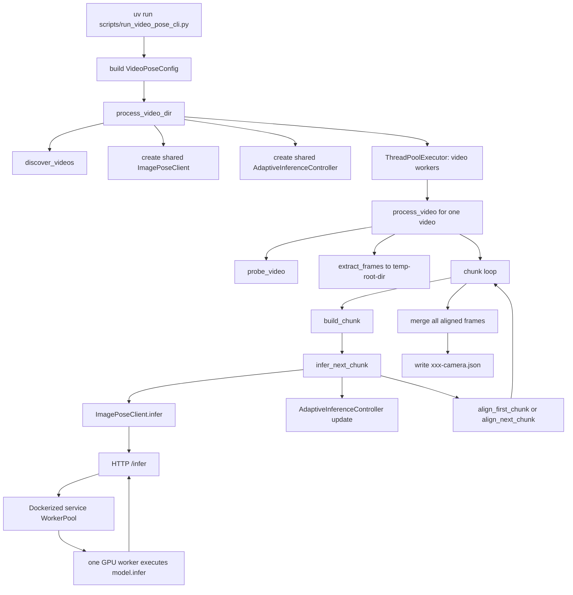

# Video2Poses 设计说明

这份文档讲当前仓库“已经实现好的版本”是怎么工作的，不是最初的需求草案。

重点回答下面几个问题：

1. 整个项目由哪些部分组成
2. `video2poses` 包内有哪些模块
3. 每个模块负责什么
4. 模块之间如何配合
5. 当前并行策略和自适应策略是什么

---

## 1. 项目整体结构

当前项目可以分成两层：

1. 服务层
2. 客户端/视频流水线层

服务层负责：

- 加载 MapAnything
- 管理多 GPU worker
- 提供 `/health` 和 `/infer` HTTP API

客户端/视频流水线层负责：

- 组织图片请求
- 组织视频切帧
- 对长视频做分块推理
- 对齐跨块位姿坐标系
- 写出最终 `*-camera.json`

### 1.1 核心文件

服务层：

- `docker/entrypoint.sh:1-13`
- `scripts/run_mapanything_service_docker.sh:1-91`
- `service/run_mapanything_service.py:1-28`
- `service/mapanything_service.py:37-70`
- `service/mapanything_service.py:133-237`
- `service/mapanything_service.py:308-482`

客户端与视频流水线层：

- `video2poses/image_pose_cli.py:45-358`
- `video2poses/video_pose_types.py:18-231`
- `video2poses/video_io.py:15-111`
- `video2poses/frame_extractor.py:9-59`
- `video2poses/chunk_planner.py:6-52`
- `video2poses/pose_alignment.py:10-155`
- `video2poses/adaptive_scheduler.py:22-181`
- `video2poses/inference_runner.py:29-104`
- `video2poses/video_pipeline.py:42-109`
- `video2poses/batch_pipeline.py:17-81`
- `scripts/run_video_pose_cli.py:13-80`

---

## 2. 端到端流程图



这个流程里最关键的设计点有三个：

1. 视频先切帧，再调用现有 image service
2. 长视频按重叠锚点分块
3. 所有视频共享一个全局自适应调度器，而不是每个视频各自乱发请求

---

## 3. 服务层设计

### 3.1 Docker 启动层

#### `scripts/run_mapanything_service_docker.sh:1-91`

职责：

- 组装 `docker run` 参数
- 绑定镜像、容器名、端口、GPU、模型路径、配置路径
- 额外挂载宿主机目录给容器

关键设计：

- 固定把模型目录挂到容器里的 `/models/map-anything`
- 固定把配置文件挂到 `/configs/service.yaml`
- 允许通过重复 `--mount` 把额外图片目录挂进容器

这也是视频流水线为什么必须关注“临时帧目录对容器可见”的原因。

#### `docker/entrypoint.sh:1-13`

职责：

- 从环境变量读 service host、port、model dir、config path
- 转调 `service/run_mapanything_service.py`

这个文件很薄，主要作用是把 Docker 环境变量和 Python 服务启动衔接起来。

### 3.2 Python 服务入口

#### `service/run_mapanything_service.py:8-24`

职责：

- 解析 `--config`、`--host`、`--port`、`--model-dir`
- 读取 YAML 配置
- 构造 FastAPI app
- 用 uvicorn 跑起来

### 3.3 服务配置加载

#### `service/mapanything_service.py:37-70`

职责：

- 读取 YAML
- 补 service 默认值
- 补 model 默认值
- 规范化 GPU 设备名
- 补 `model.infer` 默认参数

这个阶段做的是“配置标准化”，这样后面 worker 不需要再到处写兜底逻辑。

### 3.4 单 GPU worker 设计

#### `service/mapanything_service.py:133-237`

职责：

- 每个 GPU 起一个独立 worker 进程
- 在该进程里加载模型
- 接收图片路径列表
- 跑 `model.infer(...)`
- 把内参从处理后分辨率反变换回原图分辨率
- 返回 `camera_pose`、`cam_quats`、`cam_trans`、`intrinsics`

关键设计：

- 每个 worker 绑定一个固定 GPU
- OOM 会返回 `503`，而不是直接把整个服务打死
- 输出统一使用 `cam2world + OpenCV` 坐标约定

### 3.5 WorkerPool 和 HTTP API

#### `service/mapanything_service.py:308-429`

职责：

- 启动所有 worker
- 跟踪每个 worker 的 pending 数
- 按最小 pending 选择目标 worker
- 用 `Future` 把异步结果回传给 FastAPI 层

#### `service/mapanything_service.py:431-482`

职责：

- 定义 FastAPI app
- 暴露 `/health`
- 暴露 `/infer`
- 把 worker 级错误翻译成 HTTP 错误码

当前 `/health` 的设计很重要，因为视频端的自适应调度器可以用它观察队列积压情况。

---

## 4. `video2poses` 包内设计

### 4.1 类型与配置层

#### `video2poses/video_pose_types.py:18-78`

职责：

- 定义 `VideoPoseConfig`
- 对关键参数做基本校验

#### `video2poses/video_pose_types.py:81-231`

职责：

- 定义视频任务、帧记录、推理块、对齐结果、最终 JSON 结构
- 负责把最终结果对象转换成可写出的 JSON 字典

这个模块是整个视频流水线的数据契约中心。

---

### 4.2 现有 image service 客户端

#### `video2poses/image_pose_cli.py:45-229`

职责：

- 定义 `CameraIntrinsics`、`PoseEstimate`、`ImagePoseResult`、`ServiceHealth`
- 把原始 JSON 转成类型化 dataclass

#### `video2poses/image_pose_cli.py:232-358`

职责：

- 暴露 `ImagePoseClient`
- 提供 `health()` 和 `infer()`
- 做路径归一化、HTTP 请求和错误转换

视频流水线完全不直接碰 HTTP 细节，而是统一通过这个 client 调服务。

---

### 4.3 视频输入与切帧

#### `video2poses/video_io.py:15-27`

职责：

- 检查 `ffmpeg`/`ffprobe`
- 计算输出目录和输出文件名

#### `video2poses/video_io.py:30-53`

职责：

- 扫描输入目录
- 找出支持的视频文件
- 为每个视频构造 `VideoJob`

#### `video2poses/video_io.py:63-111`

职责：

- 用 `ffprobe` 读取原视频 FPS、时长、总帧数、分辨率

#### `video2poses/frame_extractor.py:9-59`

职责：

- 用 `ffmpeg -vf fps=...` 切帧
- 为每张帧图构造 `FrameRecord`
- 记录：
  - `sample_index`
  - `source_frame_index`
  - `timestamp_sec`
  - `image_path`

这里切帧目录默认是 `tempfile.mkdtemp(...)` 创建的临时目录，但可以通过 `--temp-root-dir` 控制其父目录。

---

### 4.4 分块和坐标系对齐

#### `video2poses/chunk_planner.py:6-33`

职责：

- 根据当前游标和当前 `chunk_size` 构造一个 `InferenceChunk`

关键设计：

- 首块不带重叠锚点
- 后续块会把上一块最后一帧复用为当前块第一帧

#### `video2poses/chunk_planner.py:36-52`

职责：

- 计算块消费了多少“新帧”
- 推进视频处理游标

#### `video2poses/pose_alignment.py:91-155`

职责：

- 把每个分块结果统一到同一个全局世界坐标系

核心公式：

```text
T_global_from_local = T_global_anchor @ inverse(T_local_anchor)
T_global_i = T_global_from_local @ T_local_i
```

这里：

- `T_global_anchor`
  上一块公共锚点帧在全局坐标中的位姿
- `T_local_anchor`
  当前块第一帧在当前块局部坐标中的位姿
- `T_local_i`
  当前块任意帧在当前块局部坐标中的位姿

#### `video2poses/pose_alignment.py:10-88`

职责：

- 4x4 刚体矩阵运算
- 刚体矩阵求逆
- 旋转矩阵转四元数

这里的设计决定了：

- 坐标统一是基于 `camera_pose` 4x4 矩阵做的
- `cam_quats` 和 `cam_trans` 是在对齐后重新从矩阵计算出来的
- 因此三者不会自相矛盾

---

### 4.5 自适应调度与请求执行

#### `video2poses/adaptive_scheduler.py:22-181`

职责：

- 维护全局有效批量 `effective_chunk_size`
- 维护全局有效并发 `effective_concurrency`
- 在成功时决定是否扩容
- 在失败时决定如何退避
- 在“成功但延迟过高”时主动降载

关键策略：

- 全局共享一个控制器
- 扩容需要满足：
  - 连续成功窗口
  - 低延迟
  - 队列不积压
- 降载会由两类信号触发：
  - HTTP 失败，例如 `502/503/504`
  - 成功但延迟明显过高
- 降载后会进入 cooldown，避免其他视频马上把全局批量顶回去

#### `video2poses/inference_runner.py:29-104`

职责：

- 基于控制器当前建议的 `chunk_size` 构造请求
- 调 `ImagePoseClient.infer(...)`
- 记录 latency
- 分类可重试错误
- 调度退避和重试

这是视频流水线里唯一真正“发请求”的模块。

---

### 4.6 单视频与多视频编排

#### `video2poses/video_pipeline.py:42-109`

职责：

- 处理一个视频的完整生命周期：
  - probe
  - 切帧
  - 分块推理
  - 跨块对齐
  - 合并
  - 原子写出 JSON
  - 清理临时目录

关键设计：

- 单视频内部按块顺序串行处理
- 这是为了保证：
  - 块间坐标对齐简单可靠
  - 游标推进逻辑稳定
  - 写出顺序天然正确

#### `video2poses/batch_pipeline.py:17-81`

职责：

- 处理整个输入目录
- 创建全局 `AdaptiveInferenceController`
- 创建共享 `ImagePoseClient`
- 用 `ThreadPoolExecutor` 并行跑多个视频
- 汇总成功和失败结果

#### `scripts/run_video_pose_cli.py:13-80`

职责：

- 解析 CLI 参数
- 构造 `VideoPoseConfig`
- 调用 `process_video_dir(...)`
- 打印最终 JSON summary

---

## 5. 模块之间如何配合

### 5.1 单视频内部

单视频的调用顺序是：

1. `probe_video`
2. `extract_frames`
3. `build_chunk`
4. `infer_next_chunk`
5. `align_first_chunk / align_next_chunk`
6. 合并所有 `FramePoseRecord`
7. 写出 `VideoCameraInfo`

### 5.2 多视频目录级

目录级的调用顺序是：

1. `scripts/run_video_pose_cli.py`
2. `batch_pipeline.process_video_dir`
3. `video_io.discover_videos`
4. `ThreadPoolExecutor.submit(process_video)`
5. 所有视频共享一个 `AdaptiveInferenceController`

也就是说：

- 视频之间是并行的
- 但请求并发不是无限放开的
- 因为所有视频都共享同一个全局控制器

---

## 6. 当前并行策略

当前并行策略分三层。

### 6.1 服务端并行

服务端并行来自：

- 每个 GPU 一个独立 worker 进程
- `WorkerPool` 按最小 pending 分发任务

这层并行由：

- `service/mapanything_service.py:133-237`
- `service/mapanything_service.py:308-429`

负责。

### 6.2 视频级并行

视频级并行来自：

- `ThreadPoolExecutor(max_workers=config.max_video_workers)`

这意味着多个视频可以同时：

- probe
- 切帧
- 请求服务
- 写输出

对应代码：

- `video2poses/batch_pipeline.py:45-56`

### 6.3 请求级并发限制

虽然多个视频可以并行，但真正发往 service 的请求并发会被全局控制器限制：

- `AdaptiveInferenceController.acquire_slot()`
- `AdaptiveInferenceController.release_slot()`

对应代码：

- `video2poses/adaptive_scheduler.py:63-87`

这层设计的目的，是防止：

- 每个视频都觉得自己可以高并发
- 最终把 service 一次性压垮

### 6.4 为什么单视频内部没有做块级并行预取

当前版本没有让同一个视频的多个块并发预取，原因是：

1. 后续块的全局对齐依赖前一块的锚点位姿
2. 当前版本优先保证对齐逻辑稳定和代码简单
3. 真正的瓶颈主要在 service，而不是 Python 本地调度

这是一个有意的保守设计，不是漏做。

---

## 7. Docker 场景下的临时帧设计

这是当前系统里最容易出错的一点。

视频脚本会在本地先切帧，所以 service 收到的是宿主机绝对路径。  
如果 service 跑在 Docker 里，这些路径必须在容器里也存在。

因此当前设计要求：

1. `--temp-root-dir` 指向一个宿主机目录
2. 启动 Docker service 时，把这个目录挂到容器里
3. 挂载后容器里使用相同的绝对路径

例如：

- 宿主机：
  `/home/ubuntu/xwk/learn/Video2Poses/tmp/docker_visible_frames`
- Docker `--mount`：
  `/home/ubuntu/xwk/learn/Video2Poses/tmp/docker_visible_frames:/home/ubuntu/xwk/learn/Video2Poses/tmp/docker_visible_frames:ro`
- 视频脚本：
  `--temp-root-dir /home/ubuntu/xwk/learn/Video2Poses/tmp/docker_visible_frames`

这样 service 收到的图片路径对容器是可解析的。

---

## 8. 当前版本的关键设计取舍

### 8.1 输出格式用 JSON

原因：

- 结构清晰
- 便于扩展
- 标准库可读写

### 8.2 切帧用 ffmpeg

原因：

- 稳定
- 依赖少
- 不需要引入额外 Python 视频解码栈

### 8.3 对齐只共享 1 帧锚点

原因：

- 逻辑最简单
- 先满足“统一世界坐标系”这个核心需求

后续如果需要更稳，可以升级为多锚点对齐。

### 8.4 自适应策略先保守

当前调度器优先目标不是极限吞吐，而是：

- 避免 OOM
- 避免长尾延迟无限放大
- 保持整批视频尽量稳定完成

---

## 9. 后续可以继续扩展的地方

- 同视频块级预取
- 多锚点对齐
- 中断恢复
- 跳过已完成输出
- 更精细的 VFR 时间戳支持
- 对输出轨迹做质量诊断

---

## 10. 读代码建议顺序

如果你想快速理解当前实现，建议按这个顺序读：

1. `scripts/run_video_pose_cli.py:13-80`
2. `video2poses/batch_pipeline.py:17-81`
3. `video2poses/video_pipeline.py:42-109`
4. `video2poses/inference_runner.py:29-104`
5. `video2poses/adaptive_scheduler.py:22-181`
6. `video2poses/pose_alignment.py:91-155`
7. `video2poses/image_pose_cli.py:232-358`
8. `service/mapanything_service.py:308-482`

这个顺序最接近真实运行时的数据流。
